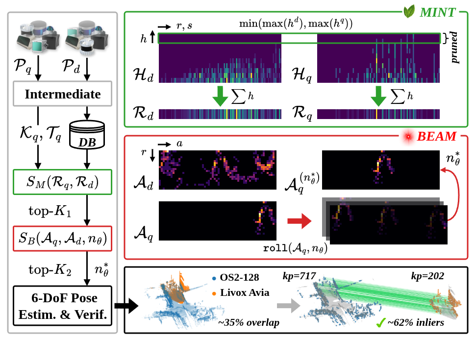
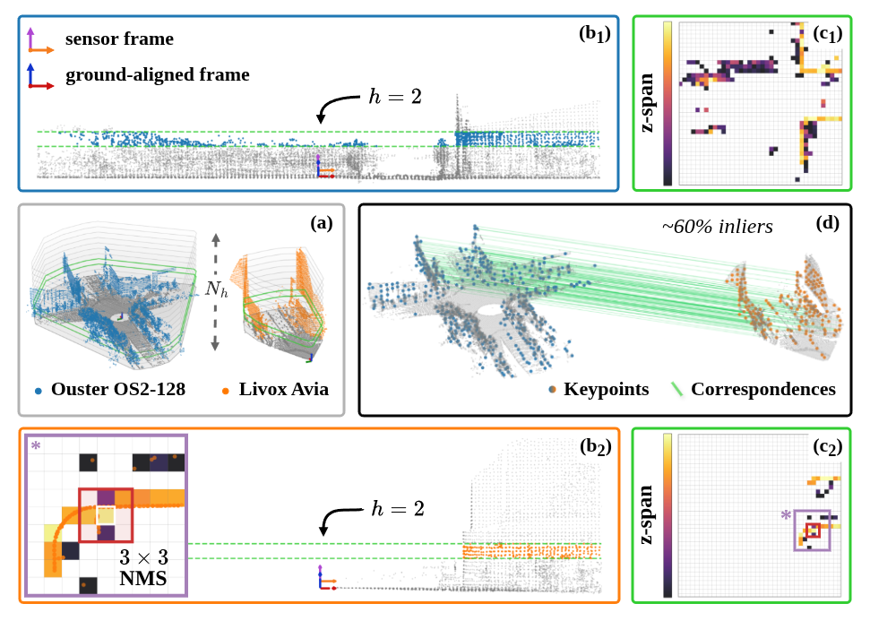
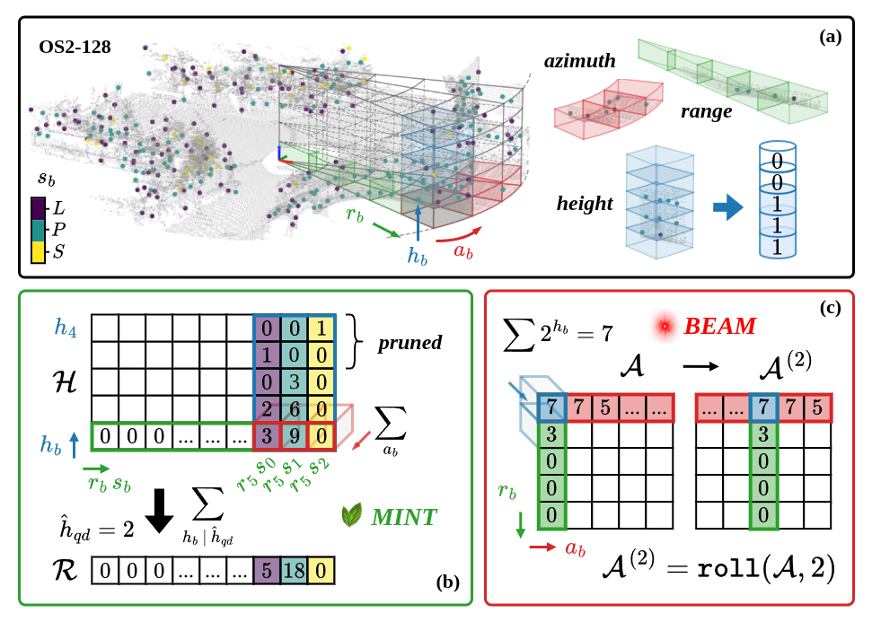
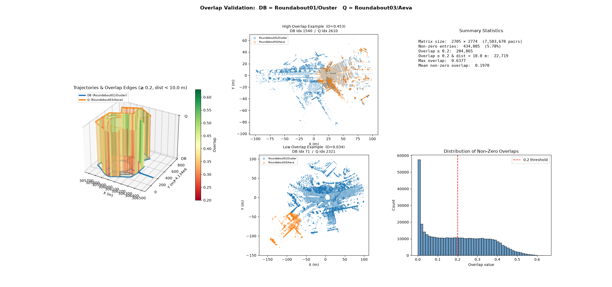
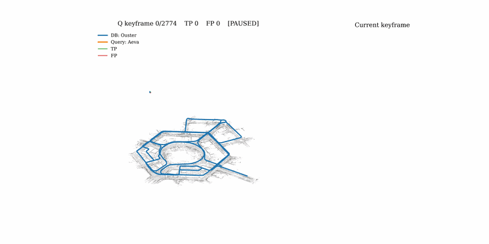

<div align="center">

# InLiER
## Learning-Free Heterogeneous LiDAR Place Recognition via Intermediate Mixed-Radix Structural Keypoint Tokenization

[](https://arxiv.org/abs/2607.16862)
[](https://doi.org/10.1109/LRA.2026.3723737)
  <a href="https://www.youtube.com/watch?v=f73wsWx8vxg/"></a>


[](https://choosealicense.com/licenses/mit/)


[**Nikolaos Stathoulopoulos**](https://github.com/nstathou) · [**George Nikolakopoulos**](https://github.com/geonikolak)

</div>

<p align=center>
  
</p>

## 💡 Introduction

**InLiER** (**In**termediate **Li**DAR **E**ncoding for **R**etrieval) is a **learning-free** place recognition pipeline for **heterogeneous** LiDAR sensors — spinning, solid-state, and FMCW units with different fields of view, resolutions, and scanning patterns. Instead of encoding a scan directly into a descriptor, InLiER inserts an **intermediate representation**: height-sliced structural keypoints are each mapped to a compact **mixed-radix token** that encodes height, radial distance, local shape, and azimuth. The same vocabulary is then re-organized on the fly across three retrieval stages, yielding fast rotation-invariant retrieval, yaw estimation and reranking, and full 6-DoF pose verification from a single sub-2KB representation.

<p align=center>
  
  
</p>

The pipeline re-organizes one token vocabulary across three stages:
- 🌿 <span style="color:green">**MINT**</span> *(Minimum-ceiling INTersection)* — height-ceiling histogram intersection for fast, rotation-invariant shortlisting.
- 💥 <span style="color:red">**BEAM**</span> *(Binary Elevation-Azimuth Matching)* — bitmask alignment for yaw estimation and reranking.
- ✔️ **Verify** — token-guided geometric verification for 6-DoF pose estimation.

## 📰 Latest News

- **[2026-09-02]** 🏷️ **v1.0.0** — the `inlier` command line (`doctor`, `config`, `encode`, `gt`, `eval`, `play`, `bench`), a layered YAML configuration, and a full documentation set under [`docs/`](docs).
- **[2026-09-01]** ⚡ The **C++ core** is out — the encoder, MINT/BEAM matcher, and token-guided verification are now C++17 with pybind11 bindings, behind the same Python API. Up to **39× faster verification** and **2.1× end-to-end** on the HeLiPR benchmark; see [C++ Core](docs/cpp-core.md).
- **[2026-08-13]** 📄 The **published RA-L version** is out — IEEE Robotics and Automation Letters, vol. 11, no. 10, pp. 11275–11282, [10.1109/LRA.2026.3723737](https://doi.org/10.1109/LRA.2026.3723737).
- **[2026-07-21]** 🎉 **Preprint and code released** — the paper is on [arXiv](https://arxiv.org/abs/2607.16862) and the Python implementation is public.
- **[2026-07-18]** ✅ The paper is **accepted** to IEEE Robotics and Automation Letters (RA-L).

## 🚀 Quickstart

Python ≥ 3.10, a C++17 compiler and CMake ≥ 3.16 (`sudo apt install build-essential cmake`) — the core compiles during `pip install`. Full details, extras, and the optional Eigen/nanoflann system packages are in [Installation](docs/installation.md).

```bash
git clone https://github.com/LTU-RAI/InLiER.git
cd InLiER
pip install -e ".[eval]"

python3 -c "import inlier; from inlier.core.InLiER import _BACKEND; print(inlier.__version__, _BACKEND)"
# 1.0.0 cpp
```

### As a library

```python
from inlier import InLiER, InLiER_Matcher, InLiER_Config, VerifyConfig

encoder = InLiER(InLiER_Config())          # defaults match config/default.yaml
matcher = InLiER_Matcher(verify_config=VerifyConfig())

db_keypoints, db_tokens = [], []
for i, scan in enumerate(database_scans):  # (N, 3) float32, sensor frame
    keypoints, tokens = encoder.encode(scan, verbose=False)
    db_keypoints.append(keypoints)
    db_tokens.append(tokens)
    matcher.add(i, tokens)
matcher.finalize()

q_keypoints, q_tokens = encoder.encode(query_scan, verbose=False)
s1 = matcher.shortlist(q_tokens, topk=100)          # MINT  — rotation-invariant
s2 = matcher.beam_score(q_tokens, s1.ids, topk=20)  # BEAM  — yaw + reranking

best, shift = s2.ids[0], s2.best_shifts[0]
result = matcher.verify(                            # token-guided 6-DoF pose
    q_tokens, q_keypoints,
    db_tokens[best], db_keypoints[best],
    azimuth_shift=shift,
)
if result.success:
    print(result.T_sensor)   # p_db = T_sensor @ p_query
```

## 🕹️ Reproducing the HeLiPR Evaluation

Example of one of the paper's main experiments: Roundabout01 (Ouster OS2-128, database) ← Roundabout03 (Aeva Aeries II, query) — spinning against solid-state. Point `--dataset` at a HeLiPR root whose `Undistorted/` folders are populated ([how](docs/helipr-benchmark.md#dataset-setup)), then:

```bash
# 0. sanity-check the backend, dependencies, and dataset layout
inlier doctor --dataset /path/to/HeLiPR

# 1. build the overlap ground truth  (precomputed under overlap_matrices/ — skip to 3)
inlier gt build \
    --dataset-type helipr \
    --dataset /path/to/HeLiPR \
    --db-sequence Roundabout01 --q-sequence Roundabout03 \
    --pairs O-Aeva \
    --output-dir overlap_matrices \
    --voxel-size 0.5 --distance-threshold 100

# 2. sanity-check it before trusting it as GT
inlier gt validate \
    --dataset-type helipr \
    --dataset /path/to/HeLiPR \
    --db-sequence Roundabout01 --q-sequence Roundabout03 \
    --pair O-Aeva \
    --overlap-dir overlap_matrices \
    --voxel-size 0.5 --pose-dist-threshold 10.0 --overlap-threshold 0.2
```

<p align=center>
  
</p>

```bash
# 3. run the evaluation
inlier eval cross-session \
    --config config/default.yaml \
    --dataset /path/to/HeLiPR \
    --db-sequence Roundabout01 --q-sequence Roundabout03 \
    --pair O-Aeva \
    --overlap-dir overlap_matrices \
    --output-dir results/HeLiPR \
    --overlap-threshold 0.2 --max-pose-dist 10.0

# 4. replay it
inlier play \
    --run-dir results/HeLiPR/dbR01-O-qR03-Aeva_vs0.5_cs1_nh10_nr20_na60_ns7 \
    --cache-dir cache_inlier
```

Step 3 writes the Recall/PR-AUC metrics (`results_*.json`), the loop-closure candidates (`candidates_*.csv`), per-pair verify poses, the descriptor caches, and a trajectory plot. What each flag does, the overlap-validation figure, and the playback controls are in [HeLiPR Benchmark](docs/helipr-benchmark.md); for anything that isn't HeLiPR, see [Your Own Data](docs/custom-data.md).

<p align=center>
  
</p>

## 📚 Documentation

| guide | what's in it |
|---|---|
| [Installation](docs/installation.md) | prerequisites, conda/venv setup, extras, verifying the build |
| [Python API](docs/python-api.md) | using InLiER as a library |
| [Command Line](docs/cli.md) | every `inlier` subcommand, descriptor inspection, submaps |
| [Configuration](docs/configuration.md) | config layering, every `--set` key, and the parameter tables |
| [C++ Core](docs/cpp-core.md) | backend selection, benchmarks, equivalence tests |
| [HeLiPR Benchmark](docs/helipr-benchmark.md) | reproduce the paper's results end to end |
| [Your Own Data](docs/custom-data.md) | generic dataset layout, overlap GT, evaluation |
| [Roadmap](docs/roadmap.md) | evaluation protocols, ROS2 support, and front-end integrations in progress |

## 🔜 Roadmap

- 🔁 More evaluation protocols — `online-lcd`, `online-global`, `multi-session`, and a GT-free `inlier run`.
- 🤖 ROS2 nodes for front-end agnostic loop closures, with a GTSAM based back-end.
- 🧩 Planned integrations with KISS-ICP, FAST-LIO2 and GLIM, so InLiER can plug into the odometry front-end you already run.

Details in [docs/roadmap.md](docs/roadmap.md).

## 🙏 Acknowledgements

We thank the authors of [**HeLiPR**](https://sites.google.com/view/heliprdataset) and [**HeLiOS**](https://github.com/minwoo0611/HeLiOS) for their open dataset and tooling, which form the base of our benchmarking ( [**HeLiPR-Pointcloud-Toolbox**](https://github.com/minwoo0611/HeLiPR-Pointcloud-Toolbox), [**HeLiPR-Place-Recognition**](https://github.com/minwoo0611/HeLiPR-Place-Recognition)).

We also thank Koide *et al.* ([@koide3](https://github.com/koide3)) for [`small_gicp`](https://github.com/koide3/small_gicp), which is used throughout our evaluation pipeline and the 6-DoF refinement step.

## 📝 Citation

If you find **InLiER** useful in your research, please consider citing:

```bibtex
@article{stathoulopoulos2026inlier,
  author={Stathoulopoulos, Nikolaos and Nikolakopoulos, George},
  journal={IEEE Robotics and Automation Letters}, 
  title={{InLiER: Learning-Free Heterogeneous LiDAR Place Recognition via Intermediate Mixed-Radix Structural Keypoint Tokenization}}, 
  year={2026},
  volume={11},
  number={10},
  pages={11275-11282},
  doi={10.1109/LRA.2026.3723737}}
}
```

## 📬 Contact

For questions, issues, or collaboration inquiries, feel free to reach out to [niksta@ltu.se](mailto:niksta@ltu.se) or open a git issue [here](https://github.com/LTU-RAI/InLiER/issues).
