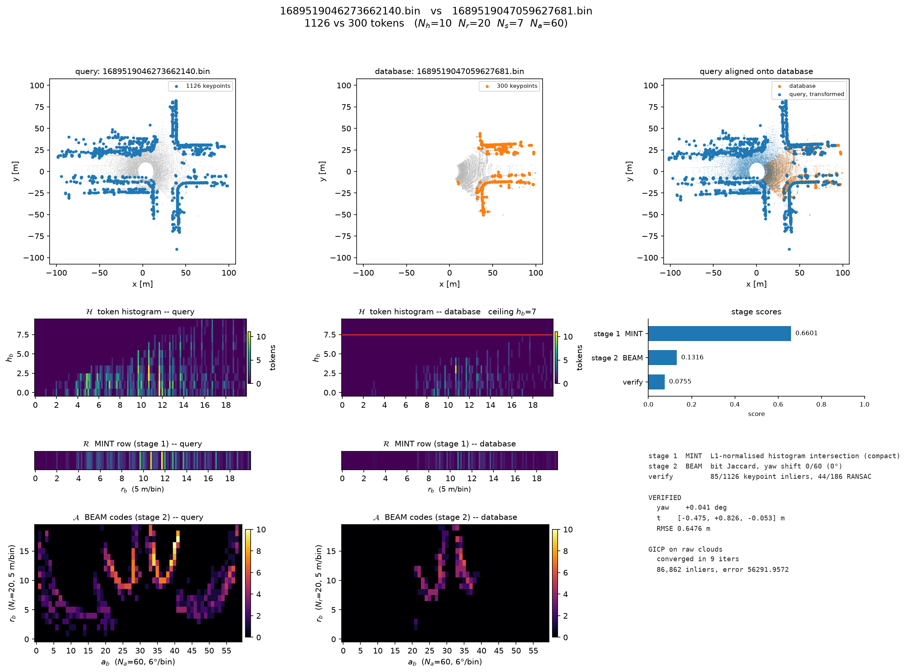

# 🖥️ Command Line

← back to the [README](../README.md)

Installing the package puts an `inlier` command on your PATH:

```bash
inlier --help
```

| command | what it does |
|---|---|
| `inlier doctor` | check the backend, dependencies, dataset layout, and ground-truth consistency |
| `inlier config show` \| `dump` | print the effective configuration — after merging defaults, `--config`, and `--set` |
| `inlier encode` | run just the encoder on a scan or a directory, writing keypoints + tokens, and optionally plotting them |
| `inlier match` | score two encodings against each other, with the stage-by-stage figure |
| `inlier gt build` \| `validate` | build or sanity-check the overlap ground truth |
| `inlier eval cross-session` | offline: full database vs full query sequence |
| `inlier eval online-lcd` | online: one session, a growing database, causal matching |
| `inlier run` | loop closures and 6-DoF poses on data with **no ground truth** — add `--live` to watch it frame by frame |
| | (`helipr`, `generic` or `kitti` data — see [Your Own Data](custom-data.md)) |
| `inlier play` | replay a finished run as an animation |
| `inlier bench cpp-vs-py` | time the C++ core against the numpy reference |

Common flags work on either side of the command name:

- `-c/--config FILE` — a YAML file, merged onto the packaged defaults
- `--set KEY=VALUE` — override one key, e.g. `--set stage1.topk=50` (repeatable)
- `--backend {auto,cpp,python}` — force a backend (see [C++ Core](cpp-core.md))
- `-q/--quiet` — suppress the banner and per-stage progress

The first two are layered onto the packaged defaults and validated — see
[Configuration](configuration.md) for the merge order and the parameter table.

## Checking a Dataset

`inlier doctor` checks `--dataset` against the layout `--dataset-type` names —
the same flag `inlier eval` takes, defaulting to `helipr`. The two layouts have
nothing in common, so point it at the right one:

```bash
inlier doctor --dataset /data/HeLiPR                          # <seq>/Undistorted/<sensor>/
inlier doctor --dataset /data/campus --dataset-type generic   # scans/ + poses_kitti.txt
```

A dataset checked against the wrong layout is reported as a layout mismatch
rather than as empty.

## Showing the Effective Configuration

`inlier config` answers "what is actually going to run?" after the packaged
defaults, `--config`, and every `--set` have been merged and validated:

```bash
inlier config show                                     # the resolved values
inlier config show -c config/default.yaml --set stage1.topk=50
inlier config dump > my_config.yaml                    # merged YAML, reusable
```

`show` prints the resolved dataclasses — including values derived from
`voxel_size`, which no YAML file lists — and takes `--mode {eval,deploy}`:
`eval` (the default) forces the stage score thresholds to `-2.0` so the PR
sweep sees every candidate, `deploy` keeps the configured thresholds. `dump`
prints the merged YAML with no banner, so its output is itself a valid
`--config` file. See [Configuration](configuration.md).

## Inspecting a Descriptor

`inlier encode --viz` draws one page per scan: the cloud and its keypoints in
the ground-aligned frame the encoder bins in, then the three matrices the
matcher actually scores on — the token histogram `H`, the MINT row `R` that
stage 1 compares, and the BEAM elevation codes `A` that stage 2 shifts and
scores — plus the shape-class and height-slice distributions.

```bash
inlier encode scan.bin --viz                       # open a window
inlier encode scan.bin --viz-save scan.png         # write it instead
inlier encode scans/ -o tokens/ --viz-save figs/   # one figure per scan
```

<p align=center>
  
</p>

<p align=center><sub>One HeLiPR Ouster scan (Bridge02): 48,938 points reduced to
658 keypoints and their tokens, occupying 0.73% of the 84,000-cell token space.</sub></p>

`--viz-save` forces a headless backend, so it works over ssh and in CI. It is
required when the input is a directory, since `--viz` alone would open a window
per scan. `-o/--output` is optional when you only want the figure.

This is the quickest way to tell whether a token grid suits a new sensor: if
the top height slices are empty, `z_max` is too high for the platform; if the
BEAM panel is nearly all one colour, `N_r`/`N_a` are too coarse to separate
structure. The parameters themselves are documented in
[Configuration](configuration.md).

## Encoding Submaps

A bare scan path encodes one scan. The evaluation encodes accumulated
**submaps** whenever `--n-db`/`--n-q` are above 1, so what you inspect should
be built the same way — `--dataset` does that, merging each window of scans
into its keyframe's frame using the poses:

```bash
inlier encode --dataset /data/campus --n-scans 10 --index 0 --viz
inlier encode --dataset /data/campus --n-scans 10 --stride 5 --range 0:20 -o submaps/
```

<p align=center>
  
</p>

<p align=center><sub>The same page for a submap instead of a scan: 40 accumulated
campus Ouster scans, 22,603 points reduced to 361 keypoints.</sub></p>

Only the scans the selected submaps need are read, so inspecting one submap out
of several hundred is cheap. `--index` accepts negatives (`-1` is the last
submap) and resolves them before they reach filenames or provenance.

`--n-scans` and `--stride` decide what a submap *is*: submap 3 at `--n-scans 10
--stride 5` is a different cloud than submap 3 at `--n-scans 20`. Nothing here
reads the overlap ground truth, so any values produce valid tokens — but to
inspect what a run encoded, pass **the values that run used**, or the index and
the figure refer to a submap it never saw. The window rule is shared with the
evaluation and the overlap builder
([`inlier/eval/submaps.py`](../inlier/eval/submaps.py)), so equal values always
give the same submaps, and `encode` records them in the `.npz` alongside the
token radices. (Matching the GT is the evaluation's own constraint — see
[Overlap Ground Truth](custom-data.md#overlap-ground-truth).)

> HeLiPR has no submap accumulation: it is evaluated scan by scan
> (`HeLiPRSource` carries no `n_scans`/`stride`, and the published results are
> one submap per scan). Point `inlier encode` straight at a `.bin`.

## Matching Two Encodings

`inlier match` takes two `.npz` files from `inlier encode` and runs the
matching stages on that pair alone:

```bash
inlier match a.npz b.npz                       # print what each stage scored
inlier match a.npz b.npz --viz                 # and plot the comparison
inlier match a.npz b.npz --viz-save cmp.png    # write the figure instead
inlier match a.npz b.npz -o scores.json        # machine-readable scores
```

The flags are `inlier encode`'s: `-o` is the data output, `--viz` opens a
window and `--viz-save` writes the figure (`--viz-dpi` sets its resolution).
Only the data format differs — there is no `.npz` to write here, so `-o`
carries the scores. Pointing `-o` at an image is an error naming `--viz-save`,
rather than JSON quietly written under a `.png` name.

```text
  stage 1  MINT   0.660061   (L1-normalised histogram intersection (compact))
  stage 2  BEAM   0.131640   (azimuth shift 0)
  verify          0.075488   (85/1126 keypoint inliers, 44/186 RANSAC)

  VERIFIED
    yaw +0.041 deg   t = [-0.475, +0.826, -0.053] m   RMSE 0.6476 m
    GICP on raw clouds: converged in 9 iters, 86862 inliers, error 56291.9572
```

`--viz` draws those same numbers with the geometry and the descriptors behind
them, both scans side by side:

<p align=center>
  
</p>

<p align=center><sub>Top row: each scan with its keypoints, then the query
transformed onto the database by the verified pose. Below it the same three
matrices for both sides -- <code>H</code>, <code>R</code>, <code>A</code> -- and
the stage scores with what each one measured.</sub></p>

## Building the Ground Truth

`inlier gt build` precomputes the pairwise overlap matrices that label true and
false positives, plus an `overlap_*.json` file recording the parameters they
were built with, which the evaluation checks before trusting a matrix:

```bash
inlier gt build --dataset /data/HeLiPR \
    --db-sequence Roundabout01 --q-sequence Roundabout03 --pairs O-Aeva \
    --output-dir overlap_matrices --voxel-size 0.5 --distance-threshold 100

inlier gt build --dataset-type generic \
    --db-path /data/campus/db --q-path /data/campus/q \
    --n-db 40 --n-q 40 --voxel-size 0.5
```

| flag | what it does |
|---|---|
| `--dataset-type {helipr,generic}` | which layout to read (default: `helipr`) |
| `--dataset`, `--db-sequence`, `--q-sequence`, `--pairs` | HeLiPR side; pairs are `O-O`, `Aeva-Aeva`, `O-V`, `O-Aeva`, `O-Avia` (default: all) |
| `--db-path`, `--q-path`, `--transform` | generic side; the transform defaults to `<db-path>/transform.txt` when present |
| `--n-db`, `--n-q`, `--stride-db`, `--stride-q` | submap accumulation; strides default to their `n` (non-overlapping) |
| `--voxel-size`, `--distance-threshold`, `--max-range` | overlap voxel δ, max pose distance for a non-zero entry, point range cap |
| `--icp`, `--icp-max-dist` | refine each DB submap against its local query cloud with GICP first |
| `--block-size` | DB scans held in memory per block — lower it if the build runs out of RAM (default: 50) |
| `--output-dir` | where the matrices and their `overlap_*.json` files go (default: `overlap_matrices`) |

`inlier gt validate` reloads the poses and scans behind a finished matrix and
plots the two trajectories, the overlap distribution, and example pairs, so a
matrix is checked before it is trusted as ground truth:

```bash
inlier gt validate --dataset /data/HeLiPR \
    --db-sequence Roundabout01 --q-sequence Roundabout03 --pair O-Aeva \
    --overlap-dir overlap_matrices \
    --voxel-size 0.5 --pose-dist-threshold 10.0 --overlap-threshold 0.2
```

<p align=center>
  
</p>

<p align=center><sub>What <code>gt validate</code> draws: the two trajectories,
the overlap distribution against the chosen threshold, and example pairs either
side of it.</sub></p>

It takes one `--pair` rather than a list, reads from `--overlap-dir`, and adds
`--pose-dist-threshold` / `--overlap-threshold` (what counts as a positive in
the plots) and `--seed` (which example pairs get drawn). Walkthroughs:
[HeLiPR Benchmark](helipr-benchmark.md) and [Your Own Data](custom-data.md).

## Running an Evaluation

`inlier eval cross-session` is the protocol behind the published results: the
whole database is visible to every query, and correctness comes from the
overlap matrix.

```bash
inlier eval cross-session --dataset /data/HeLiPR \
    --db-sequence Roundabout01 --q-sequence Roundabout03 --pair O-Aeva \
    --overlap-dir overlap_matrices -o results/HeLiPR \
    --overlap-threshold 0.2 --max-pose-dist 10.0

inlier eval cross-session --dataset-type generic \
    --db-path /data/campus/db --q-path /data/campus/q \
    --overlap-file overlap_matrices/campus.txt --n-db 40 --n-q 40 \
    -o results/campus
```

| group | flags |
|---|---|
| loader | `--dataset-type {helipr,generic}` (default: `helipr`) |
| helipr | `--dataset`, `--db-sequence`, `--q-sequence`, `--pair`, `--overlap-dir` |
| generic | `--db-path`, `--q-path`, `--db-scans`, `--db-poses`, `--q-scans`, `--q-poses`, `--overlap-file`, `--n-db`, `--n-q`, `--stride-db`, `--stride-q`, `--transform`, `--no-transform` |
| ground truth | `--overlap-threshold` (default: 0.3), `--max-pose-dist` (default: 25.0, `0` disables), `--no-strict-gt-check` |
| output | `-o/--output-dir` (default: `results`), `--cache-dir` (default: `cache_inlier`, `''` disables), `--threshold-policy {max_precision,max_f1,fixed}`, `--threshold` |

`--threshold-policy` defaults to `max_precision`; `max_f1` is what most baselines report, and passing `--threshold`
implies `fixed`. A parameter mismatch between the overlap matrix's
`overlap_*.json` and the run
is an error — `--no-strict-gt-check` downgrades it to a warning. The encoder
and retrieval parameters come from `--config`; see
[Configuration](configuration.md).

### Online loop closure detection

`inlier eval online-lcd` is the SLAM protocol: one session, no second sequence
and no overlap matrix. The database grows as the session streams, and frame
`t` may only match frames older than the exclusion window.

```bash
inlier eval online-lcd --dataset /data/HeLiPR \
    --sequence Roundabout01 --sensor Ouster \
    --exclusion frames=100 --max-pose-dist 10.0 -o results/lcd
```

| group | flags |
|---|---|
| loader | `--dataset-type {helipr,kitti,generic}` (default: `helipr`) |
| path | `--dataset` — the HeLiPR root, or the KITTI root, or the sequence directory under `--dataset-type generic` |
| helipr | `--sequence`, `--sensor` |
| kitti | `--sequence` (e.g. `00`; droppable when `--dataset` is itself a sequence directory), `--n-scans`, `--stride`. `--scans`/`--poses`/`--sensor` are refused — the layout supplies all three |
| generic | `--scans DIR`, `--poses FILE` (override `<dataset>/scans` and `<dataset>/poses_*.txt`; both together replace `--dataset`), `--n-scans`, `--stride` |
| ground truth | `--exclusion` (default: `frames=100`), `--max-pose-dist` (default: 10.0), `--search-radius` (default: 0) |
| output | `-o/--output-dir` (default: `results`), `--cache-dir` (default: `cache_inlier`, `''` disables), `--threshold-policy {max_precision,max_f1,fixed}` (default: `max_precision`), `--threshold` (implies `fixed`) |
| common | `-c/--config`, `--set KEY=VALUE`, `--backend {auto,cpp,python}`, `-q/--quiet` — as everywhere |

`--exclusion` carries its unit — `frames=N`, `seconds=S` or `metres=M` — because
the three are not interchangeable: 100 frames is a different window at 1 Hz
than at 10 Hz, and neither is 50 m. The same window computes the ground-truth
cutoff *and* the matcher's database bound, so the two cannot drift apart. The
bound is applied inside the scoring loop rather than by discarding results
afterwards, which is what stops an excluded neighbour from crowding a real
loop closure out of the top-k.

`seconds=` is the one unit that costs extra: the descriptor cache stores poses
but not timestamps, so that window alone re-reads the sequence.

Ground truth is pose distance alone, since there is no overlap matrix for a
single session. Results are reported the way loop closure is scored — `f1_max`
and max recall at 100% precision, in a `loop_closure` block — alongside a
`latency` block whose per-frame timings cover the query *and* the insertion,
and are meaningful because the database really does grow one frame at a time.

With `--dataset-type generic`, `--scans DIR` and `--poses FILE` name the two
paths directly when the data is not laid out as `<dataset>/scans` beside
`poses_kitti.txt`, and `.bin` scans are read alongside `.pcd`. See
[Test Your Own Data](custom-data.md#if-your-data-isnt-laid-out-that-way).

`--dataset-type kitti` reads the KITTI odometry benchmark, with `--sequence 00`.
Use it rather than `generic` for KITTI: its ground-truth poses are in the camera
frame and need the calibration applied, which the generic loader cannot know
about. See [KITTI Odometry](custom-data.md#kitti-odometry).

### Search radius

A SLAM front-end usually matches against a local map rather than every frame it
has ever seen. `--search-radius R` reproduces that: candidates are restricted to
database frames within `R` metres of the query. `0` — the default — searches the
whole causal past.

> ⚠️ **This is a geometric oracle.** The radius is measured against the query's
> *ground-truth* pose, which a deployed system does not have, and it deletes
> exactly the far-away distractors that make retrieval hard. Every metric goes
> up. Runs that use it are flagged in the results JSON as
> `candidate_filter.uses_pose_oracle: true`, so a number produced with a radius
> can never be mistaken for one produced without.

A radius smaller than `--max-pose-dist` is rejected: it would place real
revisits outside the searchable database, and the resulting recall loss would
read as a retrieval failure rather than the misconfiguration it is.

The filter is applied to the retrieved ranking rather than inside the matcher's
scoring loop — a radius keeps scattered indices, not a contiguous prefix, so the
matcher's bound cannot express it. That is still *exact*, because the stage
scores the entire causal set before anything is dropped; what it does mean is
that the reported `latency` over-states a radius run, since the search itself
still scans every causal frame.

## Replaying a Run

`inlier play` animates a finished run — trajectories, loop closures, and the
matched keypoints behind each one. Everything about the run's identity
(sequences, sensors, thresholds, token grid) is read back out of its
`results_*.json`, so the command takes the run directory and little else:

```bash
inlier play --run-dir results/HeLiPR/dbR01-O-qR03-Aeva_vs0.5_cs1_nh10_nr20_na60_ns7
inlier play --run-dir results/campus/... --record loops.mp4 --fps 15 --dpi 300
```

<p align=center>
  
</p>

<p align=center><sub>Roundabout01 (Ouster) against Roundabout03 (Aeva), replayed
from its run directory: the query walks the trajectory, accepted loop closures
draw to their database match, and the matched keypoints are shown per closure.</sub></p>

`SPACE` plays and pauses, the arrow keys step. `--record` renders every
keyframe to an MP4 and exits (headless, so it works over ssh); `--dataset`
points at the scans if they moved since the run; `--results-json` pins one
result file when a directory holds several; `--candidates-csv`,
`--verify-csv`, `--db-cache`, `--q-cache` skip auto-discovery. Apart from
`--record`, playback writes nothing.

### Density, and why it is the speed knob

Everything drawn is a voxel downsample of an accumulated submap, and at
`--n-scans 40` one submap is around a million points. Thinning it is the whole
per-frame cost, so these three flags trade detail against speed directly:

| flag | default | effect |
|---|---|---|
| `--q-voxel-size` | 1.0 | voxel size (m) for the per-keyframe scans; larger is coarser and faster, `0` disables downsampling |
| `--db-voxel-size` | 1.0 | same, for database scans — the prior map and the matched frame in the panel |
| `--db-map-stride` | 50 | build the prior map from every Nth keyframe. Ignored by single-session runs, which have no prior map |

```bash
# faster, coarser: good for scrubbing a long session
inlier play --run-dir results/lcd/... --q-voxel-size 2.0 --db-voxel-size 2.0

# denser map for a final render, at a longer stride to keep it affordable
inlier play --run-dir results/HeLiPR/... --db-voxel-size 0.5 --db-map-stride 20 \
    --record loops.mp4
```

The values are echoed in the header the command prints, so a recording says
what it was rendered at.

Both protocols replay with the same command — the run's JSON says which it is,
so nothing has to be passed. A cross-session run stacks its two sessions:
database below, query above, every edge crossing the gap.

An **online-lcd** run has one session and one map, so the two axes carry
different meanings instead:

- **The map lies flat on the floor** and builds up as the session plays, which
  is what an online run actually has. Nothing is painted there in advance —
  the finished map would show frames the matcher had not reached yet, the
  future leak the protocol exists to avoid.
- **The trajectory sits above it with `z` as the frame index**, so the curve
  climbs as the run proceeds and a closure edge joins two points *on that
  curve*. The height an edge spans is how long the loop took to come back
  around — the same reading as the static `trajectory_*.png`. The index is
  scaled into the plot's z range, so only the ordering and the proportions
  are meaningful; the axis itself is not drawn.

## Producing Loop Closures

`inlier eval` answers "how good is this?", which needs labels. A deployment has
none — it has scans, a drifting odometry estimate, and one question: which
frames close a loop, and what is the constraint between them. `inlier run` is
that command.

```bash
# single session: streams causally against its own past
inlier run --dataset-type kitti --dataset /data/kitti --sequence 00 \
    --n-scans 10 --exclusion seconds=30 --threshold 0.35 -o results/run

inlier run --dataset-type helipr --dataset /data/HeLiPR \
    --sequence Roundabout03 --sensor Ouster \
    --exclusion seconds=30 --threshold 0.35 -o results/run

inlier run --dataset-type generic --dataset /data/campus \
    --n-scans 40 --exclusion metres=50 --threshold 0.35 -o results/run

# ...or name the two paths, when the data is laid out some other way
inlier run --dataset-type generic \
    --scans /data/campus/clouds --poses /data/campus/traj_tum.txt \
    --n-scans 40 --exclusion metres=50 --threshold 0.35 -o results/run

# cross session: queries a fixed prior map
inlier run --dataset-type helipr --dataset /data/HeLiPR \
    --db-sequence Roundabout01 --q-sequence Roundabout03 --pair O-Aeva \
    --threshold 0.35 -o results/run

inlier run --dataset-type generic \
    --db-path /data/campus/db --q-path /data/campus/q --n-db 40 --n-q 40 \
    --threshold 0.35 -o results/run
```

| group | flags |
|---|---|
| loader | `--dataset-type {helipr,kitti,generic}` (default: `helipr`) — `kitti` is single-session only |
| path | `--dataset` — the HeLiPR root, the KITTI odometry root or one sequence directory, or the generic sequence directory |
| single, helipr | `--sequence`, `--sensor` |
| single, kitti | `--sequence` (e.g. `00`), `--n-scans`, `--stride` |
| single, generic | `--scans DIR`, `--poses FILE`, `--n-scans`, `--stride` |
| single, all | `--exclusion` (default: `frames=100`) — how much recent past a frame may not match |
| cross, helipr | `--db-sequence`, `--q-sequence`, `--pair` (e.g. `O-Aeva`) |
| cross, generic | `--db-path`, `--q-path`, `--db-scans`, `--db-poses`, `--q-scans`, `--q-poses`, `--transform`, `--no-transform` |
| cross, all | `--n-db`, `--n-q`, `--stride-db`, `--stride-q` — submap accumulation per session, ignored by HeLiPR |
| scope | `--search-radius` (default: 0 — search everything), measured on **odometry**, not ground truth |
| output | `--threshold` (**required**), `-o/--output-dir`, `--cache-dir`, `--top-k` (default: 20), `--no-score-matrices`, `--live` |

The path flags behave as they do for
[online-lcd](#online-loop-closure-detection): `--scans`/`--poses` override the
conventional `<dataset>/scans` and `<dataset>/poses_*.txt` and may replace
`--dataset` when both are given, `--n-scans`/`--stride` are ignored by HeLiPR,
and `--dataset-type kitti` refuses `--scans`, `--poses` and `--sensor` because
the KITTI layout supplies all three. Cross-session, the same flags carry a
`--db-`/`--q-` prefix, one per session.

`--transform` maps the prior map's world frame into the query's, defaulting to
`<db-path>/transform.txt` when that file exists; `--no-transform` says the two
sessions already share a frame. Both are read on the generic path only, and the
two other loaders differ in why:

### `--threshold` is required

There is no ground truth to sweep, so there is nothing to select an operating
point *from*, and `--threshold-policy` does not exist here. Pick a threshold
with `inlier eval` on a labelled sequence — its max-recall-at-100%-precision
value is the usual choice — and fix it here. A default would be someone else's
operating point silently applied to your robot.

### The poses are odometry

They accumulate submaps, they may bound the search, and they fill two
diagnostic columns. **They never accept or reject a closure** — that is the
verification score against the threshold, and nothing else. The record says
`pose_source: "odometry"` and `ground_truth: null` so the file cannot be
mistaken for an evaluation.

> ⚠️ **`--search-radius` here is not the oracle it is in `inlier eval`.** In
> [online-lcd](#--search-radius) the radius is measured against the
> *ground-truth* pose, which a deployed system does not have, so it inflates
> every metric. Here it is measured against the same drifted odometry the
> running system already has, which is what a SLAM front-end actually does —
> a scope choice, not a cheat. Same flag, opposite status, and
> `candidate_filter.pose_source` in the results records which one ran.

### What it writes

| file | what |
|---|---|
| `closures_<tag>.csv` | the product: one row per accepted closure, with its 6-DoF constraint and match quality |
| `scores_<tag>.npz` | the raw per-stage score matrices — **no decisions applied** |
| `scores_<tag>.png` | those matrices drawn, one panel per stage |
| `scores_<tag>.csv` | the same, readable: top-`--top-k` candidates per query, all stages joined |
| `per_pair_verify_<tag>.csv` | the *unrefined* verify pose, so GICP cannot erase it |
| `ranked_<tag>.csv` | stage-1 ranking |
| `trajectory_<tag>.png` | the closures drawn, in one neutral colour |
| `run_<tag>.json` | provenance, config, timing — and no metrics |

### Watching it run — `--live`

By default the run works stage by stage: encode the whole session, shortlist
everything, then rerank, verify and refine. `--live` reorders it into the loop
a deployed system actually runs — one frame at a time, accumulate, encode,
match, refine, draw — in a 3D viewer that opens **paused**:

```bash
pip install -e ".[viz]"          # pyridescence; not part of [eval]

inlier run --dataset-type kitti --dataset /data/kitti --sequence 00 \
    --n-scans 10 --exclusion seconds=30 --threshold 0.35 \
    -o results/run --live
```

Controls are buttons, not keys: play/pause, single-step, an fps cap (0 for
free-run), and checkboxes for the scan, keypoints, map and camera follow.
Turning the map off clears what is already drawn.

`--live` needs a display. `inlier doctor` reports `pyridescence` as a warning
rather than a failure when it is missing, since every other command runs
without it.

## Benchmarking the Backends

`inlier bench cpp-vs-py` runs the *same* evaluation once per backend with the
descriptor cache disabled — so the encoder is actually exercised — and
tabulates the per-stage timings:

```bash
inlier bench cpp-vs-py --dataset /data/HeLiPR \
    --db-sequence Roundabout01 --q-sequence Roundabout03 --pair O-Aeva
```

The evaluation arguments are forwarded verbatim, so benchmarking a run is the
same command line as the run itself. `--backends` chooses which to time
(default: `cpp,python`) and `--out-base` where the results go (default:
`results/bench_cpp_vs_py`). Each backend needs its own process, since
`INLIER_FORCE_PYTHON` is read at import, so a global `--backend` is ignored
here with a warning. Published numbers: [C++ Core](cpp-core.md).
