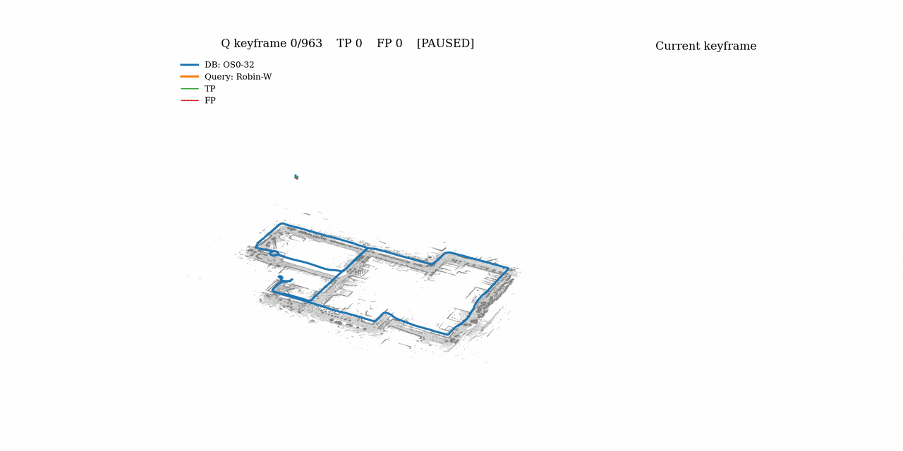

# 🗃️ Test Your Own Data

← back to the [README](../README.md)

InLiER isn't tied to the HeLiPR loader — [`inlier eval cross-session --dataset-type generic`](../inlier/eval/protocols/cross_session.py) runs the identical retrieval/evaluation pipeline on any folder-based dataset, via [`datasets/generic.py`](../inlier/eval/datasets/generic.py).

## Dataset Layout

Each of your database and query sequences is its own folder:

```text
<db_path>/ (and <q_path>/, same layout)
├── scans/
│   ├── 000000.pcd           # .bin is also read -- see Scan formats below
│   ├── 000001.pcd
│   └── ...
├── poses_kitti.txt          # preferred: 12 floats per line (row-major 3x4), 1:1 with scans
├── poses_tum.txt            # alternative: "#timestamp x y z qx qy qz qw"
└── transform.txt            # optional: 4x4, maps DB world frame → Q world frame
```

`inlier doctor --dataset <path> --dataset-type generic` checks a folder against this layout.

### If your data isn't laid out that way

The layout above is a convenience, not a requirement. `--scans DIR` and
`--poses FILE` name the two paths directly, so a dataset whose scans and poses
were never arranged into one tree needs no symlink farm to be evaluated:

```bash
inlier eval online-lcd --dataset-type generic \
    --scans ~/data/seq05/velodyne \
    --poses ~/data/gt/seq05_odometry.txt \
    --exclusion frames=100 -o results/lcd
```

Cross-session takes one pair per sequence — `--db-scans`/`--db-poses` and
`--q-scans`/`--q-poses` — and so do `inlier gt build` and `inlier gt validate`,
which matters: ground truth must be built from the same files the evaluation
reads. `inlier encode` and `inlier doctor` take the unprefixed `--scans`/`--poses`.

Either flag may be given alone. Naming only the poses while the scans stay at
`<dataset>/scans` is an ordinary case, and works.

**A named pose file is identified by its contents, not its name.** A KITTI line
is 12 numbers and a TUM line is 8, and nothing else is valid in either format,
so `odometry.txt` is read correctly without being renamed. A file that is
neither is rejected with the field count it actually had, rather than being
mis-parsed.

**What `--dataset` still does.** It names the sequence — the descriptor cache
entry, the run directory, the tag. With explicit paths and no `--dataset`, that
identity falls back to the scans directory's *parent* (`~/data/seq05/velodyne`
→ `seq05`). Pass `--dataset` as well when that guess would be unhelpful; the
explicit paths still win for finding the data.

### Scan formats

`.pcd` and `.bin` are both read. A `.bin` is a flat little-endian `float32`
dump with no header, so the one thing to get right is how many values make up a
point: the default is **4** (`x y z intensity`, the KITTI velodyne convention
that everything else copied), and the first three are taken as the coordinates.

That default is deliberately *not* second-guessed when the file size allows it.
A file of 12 floats is equally consistent with 3, 4 and 6 values per point, and
picking one by inference would scramble the coordinates rather than fail. Only
a file that 4 cannot explain gets inferred, and only when exactly one width
fits; otherwise you get an error naming the candidates. The Python API's
`Generic_Handler(bin_cols=N)` settles it for a non-standard dump.

A scan directory holding *both* `.pcd` and `.bin` is rejected rather than
merged — the usual cause is the same sequence exported twice, and silently
returning 2N files for N poses would surface much later as a count mismatch.

**`transform.txt` — when you need it.** InLiER compares database and query poses directly (to build the overlap GT and to filter candidates by `--max-pose-dist`), so both sequences must live in the *same* world frame. If they already do — e.g. both were mapped in one session, or registered to a shared global frame — no transform is needed. If they were mapped independently, each sequence's poses start at its own arbitrary origin, and the DB/Q pose distances would be meaningless. `transform.txt` is the 4×4 matrix that maps the **DB world frame into the Q world frame**, and it's applied to the DB keyframe poses before any distance or overlap computation.

The evaluation auto-detects `<db_path>/transform.txt` if it exists; pass `--transform <path>` to point elsewhere, or `--no-transform` to force the shared-frame assumption even when the file is present. Use the same choice for both [`inlier gt build`](../inlier/eval/overlap_build.py) and [`inlier eval cross-session --dataset-type generic`](../inlier/eval/protocols/cross_session.py) — a mismatch silently produces a wrong GT matrix.

**Pre-accumulated vs. single scans.** The scan directory can hold either. If your scan files are already accumulated submaps (as with the HeLiPR toolbox output), run with `--n-db 1 --n-q 1` and each file is used as-is. If they're single sensor scans, let the evaluation accumulate them: `--n-db` / `--n-q` set how many consecutive scans form one submap, each window anchored at its first scan (the keyframe) with the rest transformed into that keyframe's pose via `inv(T_i) @ T_k`. `--stride-db` / `--stride-q` set the step between consecutive submaps and default to `n_db` / `n_q`, i.e. non-overlapping submaps; a stride of 1 gives maximally overlapping ones. Either way there must be exactly one pose per scan file — the loader errors out on a count mismatch, naming both paths.

Sparse single scans (solid-state, or low-resolution spinning units) generally need accumulation for the height-slice keypoints to be stable.

## Overlap Ground Truth

[`inlier gt build`](../inlier/eval/overlap_build.py) also supports generic data — pass `--dataset-type generic --db-path ... --q-path ...` (same scans + poses layout, plus the DB→Q `--transform`), or the explicit `--db-scans`/`--db-poses`/`--q-scans`/`--q-poses` to compute the pairwise overlap matrix, just as in [Building Overlap Ground Truth](helipr-benchmark.md#building-overlap-ground-truth) for HeLiPR.

With pre-accumulated scans, the defaults (`--n-db 1 --n-q 1`) use each `.pcd` as-is:

```bash
inlier gt build \
    --dataset-type generic \
    --db-path /path/to/database \
    --q-path  /path/to/query \
    --transform /path/to/transform.txt \
    --output-dir overlap_matrices \
    --voxel-size 0.5 --distance-threshold 100
```

With single scans, accumulate them into submaps — e.g. 10 scans per submap, stepping one scan at a time:

```bash
inlier gt build \
    --dataset-type generic \
    --db-path /path/to/database \
    --q-path  /path/to/query \
    --transform /path/to/transform.txt \
    --output-dir overlap_matrices \
    --n-db 10 --n-q 10 --stride-db 1 --stride-q 1 \
    --voxel-size 0.5 --distance-threshold 100
```

A stride of 1 keeps one submap per scan, so the overlap matrix stays at full resolution (`M_db × M_q` with `M ≈ number of scans`) at the cost of a longer build. Leaving `--stride-*` out defaults it to `n`, giving non-overlapping submaps and a ~10× smaller matrix.

> ⚠️ `--n-db` / `--n-q` / `--stride-db` / `--stride-q` **must match what you later pass to** [`inlier eval cross-session`](../inlier/eval/protocols/cross_session.py) and to [`inlier encode --dataset`](cli.md#encoding-submaps) — the matrix is indexed by submap, so any difference misaligns the GT against the retrieval results. `inlier gt build` writes the values into an `overlap_*.json` file next to the matrix and the evaluation refuses to run when they disagree.

## Evaluation

```bash
inlier eval cross-session --dataset-type generic \
    --config config/default.yaml \
    --db-path /path/to/database \
    --q-path  /path/to/query \
    --transform /path/to/transform.txt \
    --overlap-file /path/to/overlap.txt \
    --overlap-threshold 0.2 --max-pose-dist 25.0 \
    --n-db 10 --n-q 10 --stride-db 1 --stride-q 1 \
    --output-dir results/generic_dataset
```

`--transform` defaults to `<db_path>/transform.txt` if present, and `--no-transform` disables it when both sequences already share a world frame. Outputs match the HeLiPR driver: `results_*.json`, `candidates_*.csv`, `ranked_*.csv`, the per-pair verify poses and the trajectory plot land under `--output-dir`; the descriptor caches go to `--cache-dir`.

## Playback

`inlier play` replays a generic run the same way it replays a HeLiPR one:

```bash
inlier play \
    --run-dir results/generic_dataset/dbcamp-db-qcamp-q_vs0.5_cs1_nh10_nr20_na60_ns7 \
    --cache-dir cache_inlier
```

<p align=center>
  
</p>

Everything it needs — the two dataset paths, `--n-db` / `--stride-db` and their query counterparts, the DB→Q transform, and the tag the filenames use — is read back out of the `results_*.json`. That is deliberate: retyping the submap accumulation would let a replay window the sequence differently from the run it is replaying. The only thing you may need to add is `--dataset`, if the folders have moved since the run.

Replaying a generic run re-reads and re-accumulates every submap from the `.pcd` files (the descriptor cache spares the encoding, not the disk), so expect the load to take a while on a long sequence.
